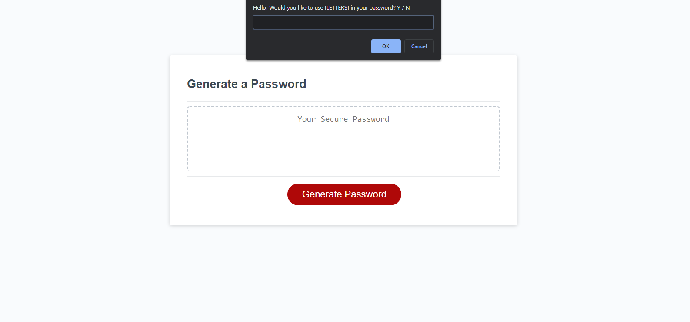

# passwordGenerator

This is a simple, lightweight password generator:

Default javascript prompt boxes ask a user a series of questions:

    "Do you want to use alphabetic characters?"
    "Do you want to use numeric characters?"
    "Do you want to use special characters?"
    "How many characters would you like your password to be?"

It does this using a few methods explained below in combonation:

--------------------------------------------------------------------------------------------------------------------------

🔴generatePassword():

No arguments when calling the method

for debugging purposes, it logs to the console which of the choices the user made when asked in the prompts

It then runs through a series of if statements checking the boolean value of the variables useChoice, useNums, and useSpchars

if the value of any of these is true it is concantinated with local-scope array called combinedArrays

after these checks are run it runs a for loop based on the user input for how desired length of the password, stored in a global variable passwordLength, selecting a random element from the array using the 🔴getRandomItemFromArray() method and using the 🔴push() method to append it to the end.

🔴getRandomItemFromArray()

Takes one argument (in this case to generate the password, it draws the locally concantinated array from the 🔴generatePassword() method) and simply returns arrayX[Math.floor(Math.random() * arrayX.length)];
thus picking one random array element.

🔴writePassword()

Stores the queary selected #password text area in the variable passwordText, for debugging purposes, logs that the button has been pressed, then stores the output of the 🔴generatePassword() in the variable password. then runs password.join(''); to remove commas when the array is displayed in the textbox. 

There is also an event listener attached to the button @ line 125.

The way user input is validated for the prompts is with a series if while loops, the variable validated is set to false initially, and after each while loop is completed until all prompts inputs have been vallidated.

they are vallidated by a series of if / if else / else statements that check if the user input a value that is vallid with the questions given options, if its not then it throws an alert asking the user to use a valid input, and repeats the loop.

